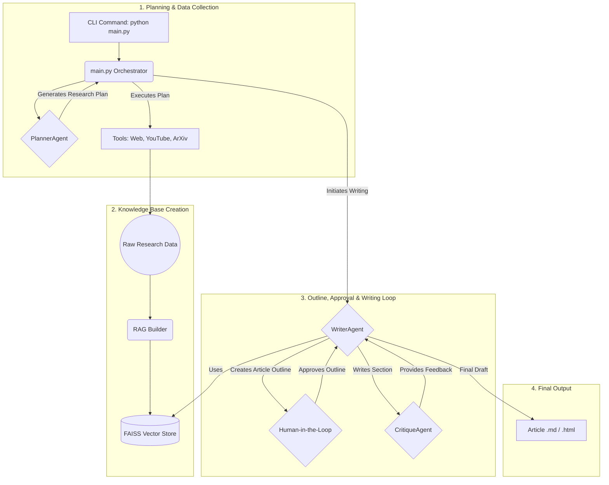

# Article Agent

I've always been intrigued by the notion of agentic AI—not just models that answer prompts, but systems that can reason, plan, and create complex things on their own. This project is my attempt to document my journey into building such a system, starting with a practical goal: generating a high-quality, well-researched article on any given topic.

This tool isn't just a simple script. It's an entire pipeline of specialized AI agents working together, from initial research to final critique, to produce content that is both factually grounded and stylistically coherent.

## Features

- Agentic Research Planning: A PlannerAgent analyzes the topic and dynamically creates a multi-step research plan, selecting the best tools for the job.

- Multi-Source Data Ingestion: Gathers information from a variety of sources using a toolkit that can:

    - Search the general web (search_general_web).

    - Target high-quality tech blogs (search_tech_blogs) and news outlets (search_news, search_finance_news).

    - Find and transcribe YouTube videos (search_youtube_transcripts).

    - Pull abstracts from academic papers on ArXiv (search_arxiv).

- Retrieval-Augmented Generation (RAG): Builds a local knowledge base from the research data using a FAISS vector store, ensuring the generated article is based on collected facts.

- Dynamic Article Outlining: The WriterAgent generates a comprehensive article plan, including section titles, key points to cover, and research queries, which it then presents for user approval.

- Style-Aware Content Generation: Analyzes a provided style_sample.txt to understand and replicate a specific writing style, including tone, voice, and sentence structure.

- Iterative Critique & Refinement: A CritiqueAgent reviews each generated section for factual consistency and style adherence, providing feedback for rewrites until a quality threshold is met.

- Human-in-the-Loop: Includes a crucial step where you, the user, must approve the generated article outline before the writing process begins.

## How It Works: The Agentic Pipeline

The process works like an assembly line of specialized agents. Here’s how they collaborate:

- The Planner (planner.py): You give it a topic. The PlannerAgent thinks about the best way to research it. It creates a ResearchPlan that outlines which tools to use and what questions to ask. For example, for a tech topic, it might decide to use search_tech_blogs and search_arxiv.

- The Collectors (tools.py): The tools are the "doers." Based on the plan, they go out and gather the raw data—scraping web pages, getting video transcripts, and fetching academic abstracts. All this information is saved into a combined_context.txt file.

- The Librarian (rag_builder.py): Once the research is done, the build_vector_store function reads the combined context, splits it into manageable chunks, and uses an embedding model to create a FAISS vector index. This turns our raw data into a searchable knowledge base.

- The Architect & Writer (writer.py): This is the core agent.

    - First, it analyzes your style_file to learn your writing style.

    - Next, it queries the RAG knowledge base to generate a detailed ArticlePlan (the outline) and asks for your approval.

    - Once you approve, it begins writing the article section by section. For each section, it queries the RAG context for relevant facts, ensuring the content is grounded in the research.

- The Editor (critique.py): After each section is written, the CritiqueAgent takes over. It compares the draft against the source context for factual accuracy and against the style profile for stylistic consistency. It generates a score and a list of suggestions. If the score is too low, the section is sent back to the WriterAgent for a rewrite.

- The Assembler (main.py): The main script orchestrates this entire flow, passing the output of one agent to the next and finally assembling the approved, critiqued sections into a final Markdown file and an html file.